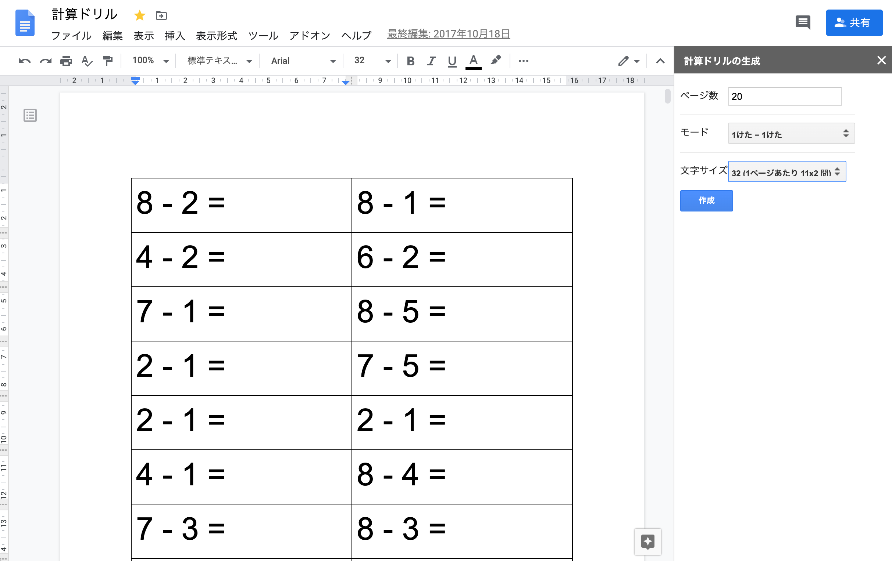
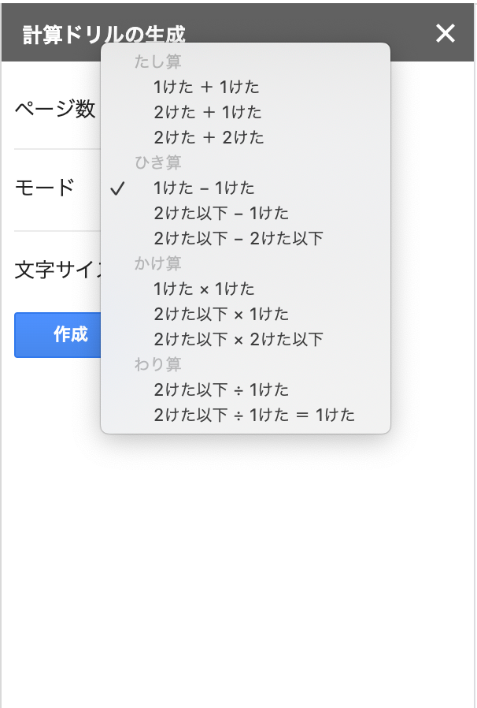
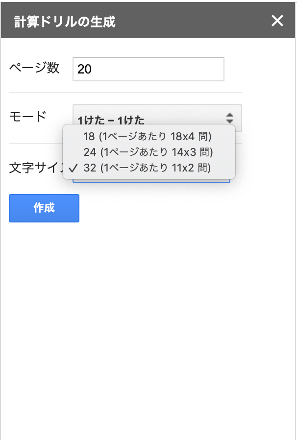

# 計算ドリルジェネレータ for Google Document
Google Documentで計算ドリルを作るGAS

# セットアップ
1. 新規Google Documentを開いて、メニューバーの　[ツール]　>　[スクリプトエディタ]　と開く
1. メニューバーの　[ファイル]　>　[新規作成]　>　[スクリプトファイル] で `calc.gs` をつくり、 `calc.gs` の中身をコピペして保存
1. メニューバーの　[ファイル]　>　[新規作成]　>　[HTMLファイル] で `sidebar.html` をつくり、 `sidebar.html` の中身をコピペして保存
1. メニューバーの　[ファイル]　>　[現在のプロジェクトのトリガー] で [トリガーを追加] を以下の設定で実行
  - 実行する関数 : onOpen
  - 実行するデプロイ : Head
  - イベントのソース : ドキュメントから
  - イベントの種類 : 起動時
1. Googleアカウントログインとかを求められるのでログインして権限を付与していく
  - Googleによる確認がすんでません〜と言われますが、詳細を開いてゴリ押しで進んでください。信用できそうかどうかはコード確認の上自己責任で。
1. Google Documentに戻って再読込

# 実行
1. サイドバーでモード、生成したいページ数、モード、文字サイズを入力して `作成` を実行 

1. しばらく待つ（実行時間はマシンスペック次第です。GASは結構遅いイメージ）
1. 印刷する
